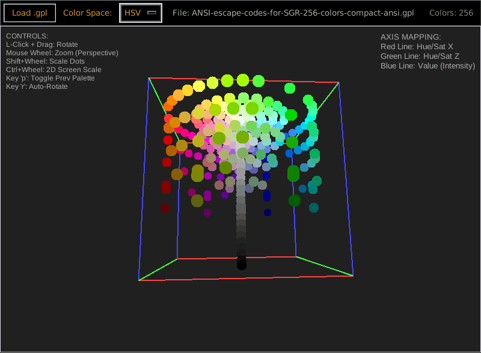
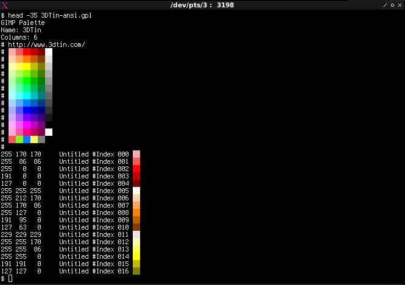

# PalePal

A lightweight, dependency-free 3D color palette viewer for Linux.

PalePal allows you to visualize GIMP Palettes (`.gpl` files) in an interactive 3D unit box. It supports multiple color spaces (RGB, HSV, CIELAB, Oklab) to help you understand the distribution, gamut, and relationships of colors in your palettes.



## Features

- **Multi-Space Visualization:** Toggle between RGB, HSV, CIELAB, LCH (Polar), and Oklab.
- **Interactive 3D View:** Rotate the view with your mouse, zoom with the scroll wheel.
- **Palette Comparison:** Load a new palette to instantly compare it against the previous one (hollow rings vs solid dots).
- **Auto-Rotation:** Spin the view around the Lightness/Intensity axis.
- **Smart Density Scaling:** Points automatically resize based on the number of colors to maintain visibility.
- **State Persistence:** Remembers your last file, zoom level, and settings between sessions via a local config file.
- **Dynamic Resizing:** The 2D view scale automatically adapts to window resizing.

## Requirements

- Python 3.x
- Tkinter (usually included with standard Python installations)

**No external dependencies required.** No `pip install` needed.

## Installation

1.  Save the script as `palepal.py`.
2.  Make it executable:
    ```bash
    chmod +x palepal.py
    ```
3.  Run it:
    ```bash
    ./palepal.py
    ```

## Controls

| Action | Control |
| :--- | :--- |
| **Rotate View** | Left Click + Drag |
| **Zoom (Perspective)** | Mouse Wheel |
| **Scale Dot Size** | Shift + Mouse Wheel |
| **2D Screen Scale** | Ctrl + Mouse Wheel |
| **Toggle Previous Palette** | Key `p` |
| **Toggle Auto-Rotation** | Key `r` |

## Color Spaces

- **RGB:** The standard Red/Green/Blue cube.
- **HSV:** Cylindrical projection. **Value (Intensity)** is mapped to the vertical Blue axis.
- **CIELAB:** Perceptually uniform space. **Lightness** is mapped to the vertical Blue axis.
- **LCH (Polar):** Cylindrical Lab view. **Lightness** is mapped to the vertical Blue axis.
- **Oklab:** Modern perceptual color space (2020). **Lightness** is mapped to the vertical Blue axis.

## Configuration

PalePal automatically saves your preferences to:
`~/.config/palepal/palepal_state.ini`

This state file preserves:
*   Last loaded palette path
*   Current Color Space selection
*   Zoom level
*   Dot scaling factor
*   2D Screen scale factor

Sample palette:


## License

MIT License

Copyright (c) [2026] Clort

Permission is hereby granted, free of charge, to any person obtaining a copy
of this software and associated documentation files (the "Software"), to deal
in the Software without restriction, including without limitation the rights
to use, copy, modify, merge, publish, distribute, sublicense, and/or sell
copies of the Software, and to permit persons to whom the Software is
furnished to do so, subject to the following conditions:

The above copyright notice and this permission notice shall be included in all
copies or substantial portions of the Software.

THE SOFTWARE IS PROVIDED "AS IS", WITHOUT WARRANTY OF ANY KIND, EXPRESS OR
IMPLIED, INCLUDING BUT NOT LIMITED TO THE WARRANTIES OF MERCHANTABILITY,
FITNESS FOR A PARTICULAR PURPOSE AND NONINFRINGEMENT. IN NO EVENT SHALL THE
AUTHORS OR COPYRIGHT HOLDERS BE LIABLE FOR ANY CLAIM, DAMAGES OR OTHER
LIABILITY, WHETHER IN AN ACTION OF CONTRACT, TORT OR OTHERWISE, ARISING FROM,
OUT OF OR IN CONNECTION WITH THE SOFTWARE OR THE USE OR OTHER DEALINGS IN THE
SOFTWARE.
